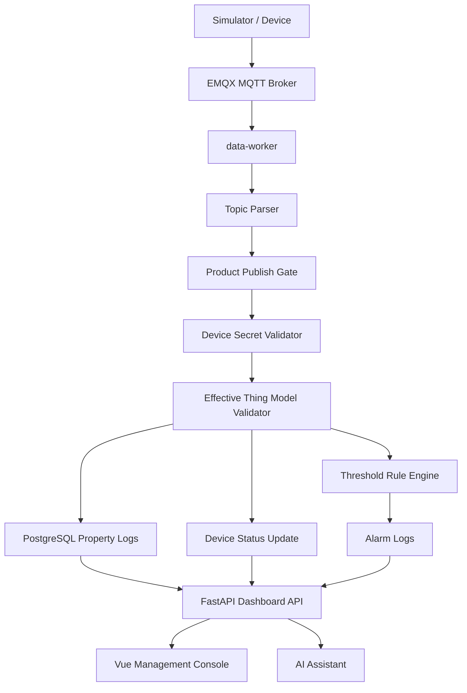

# Architecture

This project follows the same broad shape as a BladeX-style IoT platform, but uses free and open-source components.

## Target Chain

```text
category thing model -> product inherits and extends -> device instance -> MQTT/HTTP ingest
-> effective thing model validation -> storage -> rule alarm -> dashboard -> AI assistant
```

## Component Mapping

| Platform Role | Responsibility | Demo Implementation |
| --- | --- | --- |
| `blade-server` style business service | OpenAPI, device/product/rule management, dashboard APIs | `backend` with FastAPI |
| `blade-broker` style message broker | MQTT connectivity and topic routing | EMQX Community |
| `blade-data` style data flow service | Subscribe, parse, validate, store, trigger rules | `data-worker` |
| Business database | Categories, category thing models, products, product thing models, devices, rules, alarms | PostgreSQL |
| Cache/status layer | Online state and future cache/pub-sub | Redis |
| Device simulator | Generates telemetry for demos | Python `paho-mqtt` simulator |
| Frontend console | Dashboard and operator UI | Vue 3, Element Plus, ECharts |
| AI assistant | Human-friendly diagnosis and platform guidance | FastAPI endpoint with rule-based tools |

## Runtime Flow



## Management Flow

```mermaid
flowchart LR
    A["Create Category"] --> B["Define Category Thing Model"]
    B --> C["Create Product"]
    C --> D["Inherit Category Model"]
    D --> E["Extend Product Model"]
    E --> F["Create Device Instance"]
    F --> G["MQTT Property Report"]
    G --> H["Validate Against Effective Model"]
    H --> I["Rule Alarm"]
    I --> J["AI Alarm Explanation"]
```



## Thing Model Inheritance

The demo now models the BladeX-style hierarchy directly:

- Category thing models define common abilities for a device class, such as `temperature` and `humidity` for sensors.
- Product thing models store only product-specific extensions or overrides, such as `battery` for `TEMP_SENSOR`.
- A device is an instance of a product and is validated against the effective model: category inherited models merged with product extensions.
- When product and category define the same `identifier` and `model_type`, the product-level definition wins.
- A product must be published/online before telemetry is accepted. This mirrors the platform rule that a draft model should not drive historical storage.
- The demo validates the device credential inside the telemetry envelope so the full chain can be tested locally. Broker-level credential enforcement is still deferred.

## Topic Protocol

The demo uses `/demo` as the prefix instead of copying a vendor namespace.

```text
/demo/sys/{productKey}/{deviceName}/thing/event/property/post
```

Example product and device:

```text
productKey: TEMP_SENSOR
deviceName: demo-device-001
deviceSecret: demo-secret
```

Payload:

```json
{
  "id": "1700000000000",
  "version": "1.0",
  "method": "thing.event.property.post",
  "params": {
    "temperature": 25.5,
    "humidity": 60.2,
    "battery": 88
  }
}
```

## Current Scope

Included:

- Single-node Docker Compose environment.
- One seeded category, product, device, inherited thing model set, and threshold rule.
- MQTT property reports.
- First-version property log storage in PostgreSQL.
- Dashboard and rule alarm display.
- Management console for categories, products, devices, category thing models, product thing models, effective thing models, and rules.
- Rule-based AI assistant with alarm explanation.

Deferred:

- MQTT broker-level credential enforcement.
- Device shadow.
- OTA.
- Kafka/Redpanda message bus.
- TDengine/InfluxDB/TimescaleDB dedicated time-series backend.
- Multi-tenant RBAC.
- Node-RED edge workflow integration.
- Real LLM-backed agent tool calling.
